# Cấu trúc Hệ thống và Quy trình Nghiệp vụ

## 1. USE CASE DIAGRAM (Sơ đồ tổng quan Tác nhân & Quy�n hạn)

```mermaid
flowchart LR
    %% �ịnh nghĩa các Actors (Tác nhân)
    SV((Sinh viên))
    GV((Giảng viên))
    GVu((Giáo vụ))
    CTSV((CB Công tác SV))
    KT((Kế toán))
    Admin((Quản trị viên))

    %% Khung Hệ thống
    subgraph SIS [HỆ TH�NG QUẢN L� SINH VIÊN - SIS]
        %% SV (Tương tác trực tiếp)
        UC_SV1([�ăng ký h�c phần])
        UC_SV2([Xem TKB & Bảng điểm])
        UC_SV3([Xem Hóa đơn & Nộp ti�n])
        UC_SV4([Nộp đơn phúc khảo])
        
        %% GV (Giảng dạy & Cố vấn)
        UC_GV1([Xem DS Lớp & �iểm danh])
        UC_GV2([Nhập & Khóa điểm])
        UC_GV3([Chấm phúc khảo])
        UC_GV4([Cố vấn h�c tập])
        
        %% Giáo vụ (Quản lý đào tạo cốt lõi)
        UC_GVu1([Quản lý Danh mục & Hồ sơ])
        UC_GVu2([Mở Lớp & Xếp TKB])
        UC_GVu3([Quản lý Khảo thí & Lịch thi])
        UC_GVu4([Xét duyệt Tốt nghiệp & Văn bằng])
        
        %% CTSV (Quản lý đ�i sống & rèn luyện)
        UC_CT1([Quản lý �iểm rèn luyện])
        UC_CT2([Xét Khen thưởng / Kỷ luật])
        UC_CT3([Quản lý H�c bổng])
        
        %% Kế toán (Tài chính)
        UC_KT1([Thiết lập Mức h�c phí])
        UC_KT2([Tính công nợ & Quản lý Phiếu thu])
        UC_KT3([Quản lý Miễn giảm])
        
        %% Admin (Quản trị hệ thống)
        UC_Ad1([Quản lý Users & Phân quy�n])
        UC_Ad2([Cấu hình Hệ thống & Audit Log])
        UC_Ad3([Dashboard & Báo cáo thống kê])
    end

    %% Móc nối Actor với Use Case
    SV --> UC_SV1
    SV --> UC_SV2
    SV --> UC_SV3
    SV --> UC_SV4

    GV --> UC_GV1
    GV --> UC_GV2
    GV --> UC_GV3
    GV --> UC_GV4

    GVu --> UC_GVu1
    GVu --> UC_GVu2
    GVu --> UC_GVu3
    GVu --> UC_GVu4

    CTSV --> UC_CT1
    CTSV --> UC_CT2
    CTSV --> UC_CT3

    KT --> UC_KT1
    KT --> UC_KT2
    KT --> UC_KT3

    Admin --> UC_Ad1
    Admin --> UC_Ad2
    Admin --> UC_Ad3
    
    %% Phân quy�n Báo cáo chéo
    GVu -.-> UC_Ad3
    KT -.-> UC_Ad3
    CTSV -.-> UC_Ad3
    
    %% Style
    classDef actor fill:#f9f9f9,stroke:#333,stroke-width:2px;
    class SV,GV,GVu,CTSV,KT,Admin actor;
```



## 2. ACTIVITY DIAGRAM (Quy trình �ăng ký h�c phần)

```mermaid
flowchart TD
    Start((Bắt đầu)) --> Req[SV gửi Yêu cầu �ăng ký môn]
    Req --> DB_Trans{{"Bắt đầu DB Transaction"}}
    
    %% Validate 1
    DB_Trans --> Check_Class{"1. Lớp có trạng thái 'Open'\n& Trong hạn �ăng ký?"}
    Check_Class -- Không --> Err1[Lỗi: Lớp không hợp lệ]
    
    %% Validate 2 (Chống Race Condition)
    Check_Class -- Có --> Lock_Row[Select_for_update() khóa dòng Lớp h�c phần]
    Lock_Row --> Check_Cap{"2. Sĩ số hiện tại < Sĩ số tối đa?"}
    
    Check_Cap -- Không --> Err2[Lỗi: Lớp đã đầy]
    
    %% Validate 3
    Check_Cap -- Có --> Check_SV{"3. Trạng thái SV là '�ang h�c'?"}
    Check_SV -- Không --> Err3[Lỗi: SV bị khóa/Bảo lưu]
    
    %% Validate 4
    Check_SV -- Có --> Check_Pre{"4. �ã đạt môn Tiên quyết?"}
    Check_Pre -- Không --> Err4[Lỗi: Nợ môn tiên quyết]
    
    %% Validate 5
    Check_Pre -- Có --> Check_Clash{"5. Trùng TKB (Thứ & Tiết)\nvới lớp đã đăng ký?"}
    Check_Clash -- Có --> Err5[Lỗi: Trùng th�i khóa biểu]
    
    %% Thá»±c thi (Update DB)
    Check_Clash -- Không --> Action1[Tạo Bản ghi vào bảng Enrollments]
    Action1 --> Action2[Cập nhật +1 Sĩ số vào course_offerings]
    Action2 --> Action3[Tính h�c phí: Số Tín chỉ * �ơn giá]
    Action3 --> Action4[Cộng dồn ti�n vào Hóa đơn (Invoices)]
    
    %% Hoàn tất Transaction
    Action4 --> Commit{{"Commit Transaction"}}
    
    %% Nhánh Rollback khi gặp lỗi
    Err1 --> Rollback{{"Rollback Transaction"}}
    Err2 --> Rollback
    Err3 --> Rollback
    Err4 --> Rollback
    Err5 --> Rollback
    
    %% Phản hồi Frontend
    Commit --> Success[HTTP 200 OK - Thành công]
    Rollback --> Fail[HTTP 400 Bad Request - Thất bại]
    
    Success --> End((Kết thúc))
    Fail --> End

    %% Style
    classDef success fill:#d4edda,stroke:#28a745,stroke-width:2px;
    classDef error fill:#f8d7da,stroke:#dc3545,stroke-width:2px;
    classDef transaction fill:#fff3cd,stroke:#ffc107,stroke-width:2px,stroke-dasharray: 5 5;
    
    class Success success;
    class Err1,Err2,Err3,Err4,Err5,Fail error;
    class DB_Trans,Commit,Rollback transaction;
```

## 3. ACTIVITY DIAGRAM (Quy trình Nh?p di?m & Phúc kh?o)

```mermaid
flowchart TD
    Start((Bắt đầu)) --> Req1[GV nhập/chỉnh sửa �iểm thành phần]
    Req1 --> CheckLock{"C� is_locked == true?"}
    
    CheckLock -- Có --> Err1[Lỗi: �iểm đã bị khóa, không thể sửa]
    CheckLock -- Không --> Save[Lưu �iểm (Update Enrollments)]
    
    Save --> LockPoint[GV bấm Khóa điểm cuối kỳ]
    LockPoint --> SetLock[Cập nhật is_locked = true]
    
    %% Sinh viên nộp đơn
    SetLock --> SV_Appeal[SV xem điểm và nộp �ơn Phúc khảo]
    SV_Appeal --> CreateReview[Tạo bản ghi Grade_Reviews (status: pending)]
    
    %% GV xử lý
    CreateReview --> GV_Review[Cán bộ/GV tiếp nhận và Chấm lại]
    GV_Review --> Decision{"Quyết định?"}
    
    %% Không đổi điểm
    Decision -- Giữ nguyên --> Reject[Cập nhật Grade_Reviews: rejected]
    Reject --> End((Kết thúc))
    
    %% Có đổi điểm
    Decision -- �ổi điểm --> Approve[Cập nhật Grade_Reviews: approved]
    Approve --> DB_Trans{{"Bắt đầu Transaction"}}
    DB_Trans --> Unlock[Tạm th�i Unlock is_locked = false]
    Unlock --> UpdateScore[Cập nhật điểm mới vào Enrollments]
    UpdateScore --> Relock[Khóa lại is_locked = true]
    Relock --> Commit{{"Commit Transaction"}}
    
    Commit --> End
    Err1 --> End

    %% Style
    classDef success fill:#d4edda,stroke:#28a745,stroke-width:2px;
    classDef error fill:#f8d7da,stroke:#dc3545,stroke-width:2px;
    classDef transaction fill:#fff3cd,stroke:#ffc107,stroke-width:2px,stroke-dasharray: 5 5;
    
    class Reject,Approve success;
    class Err1 error;
    class DB_Trans,Commit transaction;
```
